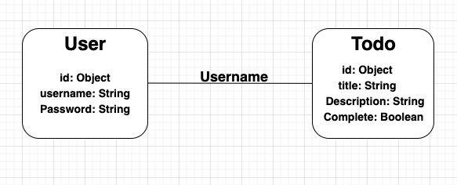

# Seal Project 2

## Christian Alexander 
### TodoList App 
##### An App where the user can add, edit and delete todos 
 - https://github.com/Adrick1210/seal-project2.git
 - https://seal-project.onrender.com
 - https://trello.com/b/RwV3fG3X/todo-list-aop

## List of Dependencies

##### Node Dependencies (package.json)

- express
- nodemon
- method-override
- morgan
- mongoose
- dotenv
- ejs
- bcryptjs
- express-session 
- connect-mongo

##### Frontend (If used, ex. jquery, alpine, bootstrap, htmx, etc)

- CSS

## Route Map

Below should be a table listing the different routes in your app and their purposes

| Route name  | endpoint | method | Description                 |
| ----------- | -------- | ------ | --------------------------- |
| Todos Index | /todos   | GET    | Renders all todos on a page |
| Todos New | /todos/new   | GET    | Renders a form to create a todo |
| Todos Create | /todos   | POST    | Renders a created todo on the Index Page |
| Todos Edit | /todos/:id/edit   | GET    | Renders renders a form to edit a id using by the id |
| Todos Update | /todos/:id   | PUT    | Updates data to a todo on the Todos Index by id |
| Todos Delete/Destroy | /todos/:id   | DELETE   | Removes a todo from the data array |
| Todos show | /todos/:id   | GET    | Renders selected todo by id on a page |

## Design Mockup (Desktop + Mobile)

##### Mobile Design

##### Desktop Design

## ERD (entity relationship diagram)

